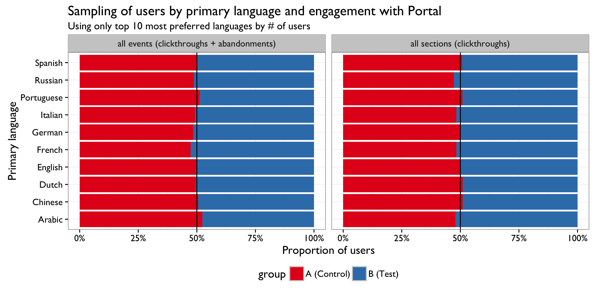

```{r setup, include = FALSE}
knitr::opts_chunk$set(echo = FALSE, message = FALSE, warning = FALSE)
```

\renewcommand{\abstractname}{Executive Summary}
\begin{abstract}
...
\end{abstract}

## Introduction

The Wikimedia Foundation (WMF) is dedicated to encouraging the growth, development, and distribution of free, *multilingual*, educational content. WMF operates Wikipedia, a project to build free encyclopedias in *all languages of the world*. For the Discovery Department's Portal team (tasked with making the wikipedia.org a more engaging and friendlier portal to free knowledge), it is important that all visitors, regardless of language, receive a more welcoming experience.


\newpage

## Methods

In general, we randomly select 1 in 200 users to be included in [Wikipedia Portal EventLogging schema](https://meta.wikimedia.org/wiki/Schema:WikipediaPortal). Of those, we randomly select 1 in 10 to be included in the A/B test. If selected for the test, the user is assigned either variation A (the default experience) or variation B (the experimental experience) with 50%/50% probability. The test ran for 22 days and we logged 35K users' clickthroughs and abandonments. We utilized the R package [*BCDA* (0.1.0)](https://github.com/bearloga/BCDA) to perform a Bayesian analysis of the test, assuming a Beta-Binomial model. The code for the [exploratory data analysis](https://github.com/wikimedia-research/Discovery-Portal-Test-PrimaryLinkLangDetect/blob/master/eda.R) and the [confirmatory data analysis](https://github.com/wikimedia-research/Discovery-Portal-Test-PrimaryLinkLangDetect/blob/master/cda.R) can be found on the [GitHub repository for this analysis](https://github.com/wikimedia-research/Discovery-Portal-Test-PrimaryLinkLangDetect).

## Results

### Sampling and Bucketing

In Fig. 2 we see that bucketing -- assigning randomly sampled users to either controls ("A") or the test group ("B") -- was performed evenly, without bias towards any particular language(s). In Fig. 3 we can see that if we look at just the clickthrough by group without breaking it up by section and without taking into consideration the user's preferred languages (from their Accept-Language header), the two groups behave nearly identically in aggregate.




\newpage

### Clickthrough Rates

Our **[previous investigation](https://commons.wikimedia.org/wiki/File:Analysis_of_Clickthrough_Rates_and_User_Preferred_Languages_on_Wikipedia_Portal.pdf)** of language preferences and engagement with Portal revealed that users whose preferences include English search more and engage with the primary links (the language links around the Wikipedia logo) more than users whose preferences do not include English. We see the same pattern in Fig. 4, where users whose preferences include English are much more likely to engage with the primary language links and the search box, while users whose preferences do not include English are more likely to engage with the secondary language links.

We can also see in Figure 4 and Table 1 that in both sets of users, the test group is slighly more likely to engage with the primary links (the part affected by the A/B test) than the control group. Specifically, when considering only the users whose preferences included English (where we observed the largest difference), the test group has a 1.32% higher primary link clickthrough and is 1.064 times more likely to clickthrough than the control group.

Unfortunately, these differences aren't "statistically significant" -- the 95% Bayesian confidence intervals include 0 for the difference of proportions and 1 for the relative risk, meaning we don't have evidence of big impact. The same numbers for the users who did not include English are: 0.84% difference and 1.053 times more more likely to click on a primary link. However, as we will see in the following section, the real difference is hidden in the relationship between the language of the Wikipedia the user goes to and their preferred language(s).


\begin{landscape}

\begin{table}

\caption{Clickthrough rate by accept-language, link, and group. This is the table version of Figure 4.}
\centering
\renewcommand{\arraystretch}{2.0}% for the vertical padding
\begin{tabular}[t]{l|l|l|r}
\hline
\textbf{Includes English} & \textbf{Link} & \textbf{Group} & \textbf{Clickthrough Rate}\\
\hline\hline
Accept-Language doesn't include English & primary & A (Control) & 16.49\%\\
\hline
Accept-Language doesn't include English & primary & B (Test) & 17.33\%\\
\hline
Accept-Language doesn't include English & search & A (Control) & 26.06\%\\
\hline
Accept-Language doesn't include English & search & B (Test) & 25.35\%\\
\hline
Accept-Language doesn't include English & secondary & A (Control) & 1.51\%\\
\hline
Accept-Language doesn't include English & secondary & B (Test) & 1.50\%\\
\hline
Accept-Language includes English & primary & A (Control) & 21.18\%\\
\hline
Accept-Language includes English & primary & B (Test) & 22.50\%\\
\hline
Accept-Language includes English & search & A (Control) & 38.22\%\\
\hline
Accept-Language includes English & search & B (Test) & 35.67\%\\
\hline
Accept-Language includes English & secondary & A (Control) & 0.90\%\\
\hline
Accept-Language includes English & secondary & B (Test) & 0.87\%\\
\hline
\end{tabular}
\label{table:ctr}
\end{table}

\end{landscape}

\newpage

\subsection*{Destination}

Figures \ref{fig:visits_all}---\ref{fig:visits_multilang} and Tables \ref{table:visits_all}---\ref{table:visits_multilang} below summarize the statistical comparisons of the test group against the controls. "\% Diff" refers to -- for example -- "\% of B who visited Wikipedia in a preferred language \textbf{\emph{minus}} \% of A who visited Wikipedia in a preferred language", with positive numbers indicating that more of B had the successful outcome than A did. Relative risk is interpreted as "$X$ times more likely to visit Wikipedia in a preferred language" and odds ratio is interpreted as "the odds of group B users visiting Wikipedia in a preferred language are $X$ times the odds of group A users".

Most notably (in Figure \ref{fig:visits_all} and Table \ref{table:visits_all}) 16.1\% more users whose Accept-Language header did not include English visited Wikipedia in one of their preferred languages in group B than in group A, and were 1.3 times more likely to go to a Wikipedia in one of their preferred languages. Furthermore, 15.5\% more B users visited a Wikipedia in their \emph{most} preferred language than A users, and were 1.3 times more likely to visit such a Wikipedia. The other two comparisons imply that (1) the test does not appear to have had an effect on users whose Accept-Language header included English, and (2) the results for secondary links mirror the results for the primary links, but negative, which implies that people were indeed using the dynamic primary links to visit a Wikipedia in their language.

In Figure \ref{fig:visits_non-prime-en} and Table \ref{table:visits_non-prime-en}...

In Figure \ref{fig:visits_non-en} and Table \ref{table:visits_non-en}...

In Figure \ref{fig:visits_multilang} and Table \ref{table:visits_multilang}...

\subsection*{Discussion}

\newpage

\begin{landscape}

\begin{figure}
\caption{The types of Wikipedias that \emph{all} users visited from the Portal.}
\includegraphics{figures/wikipedia_visits_all.png}
\label{fig:visits_all}
\end{figure}

\begin{table}

\caption{Among all users, those whose Accept-Language header did not include English were more likely to engage with the primary links to visit a Wikipedia either in their most preferred language or one of their preferred languages.}
\centering
\renewcommand{\arraystretch}{1.5}% for the vertical padding
\begin{tabular}[t]{l|l|l|l|l|l}
\hline
\textbf{Link} & \textbf{Includes English} & \textbf{Visited Wikipedia} & \textbf{\% Diff (B vs A)} & \textbf{Relative Risk} & \textbf{Odds Ratio}\\
\hline\hline
primary & A-L doesn't include En & in one of their preferred languages & 16.1 (9.9, 21.8) & 1.30 (1.18, 1.44) & 2.01 (1.51, 2.54)\\
\hline
primary & A-L doesn't include En & in their most preferred language & 15.5 (9.4, 21.2) & 1.29 (1.17, 1.43) & 1.95 (1.47, 2.46)\\
\hline
primary & A-L includes En & in one of their preferred languages & 0.4 (-1.5, 2.3) & 1.00 (0.98, 1.03) & 1.06 (0.83, 1.31)\\
\hline
primary & A-L includes En & in their most preferred language & 1.9 (-0.7, 4.6) & 1.02 (0.99, 1.06) & 1.13 (0.95, 1.31)\\
\hline
secondary & A-L doesn't include En & in one of their preferred languages & -14.1 (-28.8, 1.5) & 0.46 (0.09, 0.93) & 0.41 (0.06, 0.92)\\
\hline
secondary & A-L doesn't include En & in their most preferred language & -14.1 (-28.8, 1.5) & 0.46 (0.09, 0.93) & 0.41 (0.06, 0.92)\\
\hline
secondary & A-L includes En & in one of their preferred languages & -9.2 (-25.1, 6.9) & 0.78 (0.42, 1.17) & 0.71 (0.26, 1.25)\\
\hline
secondary & A-L includes En & in their most preferred language & -5.7 (-19.7, 10.0) & 0.83 (0.38, 1.35) & 0.80 (0.27, 1.48)\\
\hline
\end{tabular}
\label{table:visits_all}
\end{table}

\end{landscape}

\newpage

\begin{landscape}

\begin{figure}
\caption{The types of Wikipedias that \emph{non-\textbf{primarily}-English-speaking} users visited from the Portal.}
\includegraphics{figures/wikipedia_visits_non-prime-En.png}
\label{fig:visits_non-prime-en}
\end{figure}

\begin{table}

\caption{...caption...}
\centering
\renewcommand{\arraystretch}{1.5}% for the vertical padding
\begin{tabular}[t]{l|l|l|l|l|l}
\hline
Link & Includes English & Visited Wikipedia & \% Diff (B vs A) & Relative Risk & Odds Ratio\\
\hline\hline
primary & A-L doesn't include En & in one of their preferred languages & 0.2 (0.1, 0.2) & 1.30 (1.18, 1.44) & 2.01 (1.51, 2.54)\\
\hline
primary & A-L doesn't include En & in their most preferred language & 0.2 (0.1, 0.2) & 1.29 (1.17, 1.43) & 1.95 (1.47, 2.46)\\
\hline
primary & A-L includes En & in one of their preferred languages & -0.0 (-0.0, 0.0) & 0.99 (0.97, 1.02) & 0.90 (0.34, 1.55)\\
\hline
primary & A-L includes En & in their most preferred language & 0.1 (0.0, 0.2) & 1.25 (1.09, 1.42) & 1.59 (1.17, 2.04)\\
\hline
secondary & A-L doesn't include En & in one of their preferred languages & -0.1 (-0.3, 0.0) & 0.46 (0.09, 0.93) & 0.41 (0.06, 0.92)\\
\hline
secondary & A-L doesn't include En & in their most preferred language & -0.1 (-0.3, 0.0) & 0.46 (0.09, 0.93) & 0.41 (0.06, 0.92)\\
\hline
secondary & A-L includes En & in one of their preferred languages & 0.1 (-0.2, 0.4) & 1.14 (0.59, 1.77) & 1.60 (0.16, 3.99)\\
\hline
secondary & A-L includes En & in their most preferred language & 0.2 (-0.1, 0.4) & 1.70 (0.56, 3.32) & 2.59 (0.21, 6.43)\\
\hline
\end{tabular}
\label{table:visits_non-prime-en}
\end{table}

\end{landscape}

\newpage

\begin{landscape}

\begin{figure}
\caption{The types of Wikipedias that \emph{not-\textbf{just}-English-speaking} users visited from the Portal.}
\includegraphics{figures/wikipedia_visits_non-En.png}
\label{fig:visits_non-en}
\end{figure}

\begin{table}

\caption{...caption...}
\centering
\renewcommand{\arraystretch}{1.5}% for the vertical padding
\begin{tabular}[t]{l|l|l|l|l|l}
\hline
\textbf{Link} & \textbf{Includes English} & \textbf{Visited Wikipedia} & \textbf{\% Diff (B vs A)} & \textbf{Relative Risk} & \textbf{Odds Ratio}\\
\hline\hline
primary & A-L doesn't include En & in one of their preferred languages & 0.2 (0.1, 0.2) & 1.30 (1.18, 1.44) & 2.01 (1.51, 2.54)\\
\hline
primary & A-L doesn't include En & in their most preferred language & 0.2 (0.1, 0.2) & 1.29 (1.17, 1.43) & 1.95 (1.47, 2.46)\\
\hline
primary & A-L includes En & in one of their preferred languages & -0.0 (-0.0, 0.0) & 1.00 (0.97, 1.02) & 0.94 (0.40, 1.57)\\
\hline
primary & A-L includes En & in their most preferred language & 0.1 (0.0, 0.1) & 1.16 (1.03, 1.30) & 1.40 (1.06, 1.77)\\
\hline
secondary & A-L doesn't include En & in one of their preferred languages & -0.1 (-0.3, 0.0) & 0.46 (0.09, 0.93) & 0.41 (0.06, 0.92)\\
\hline
secondary & A-L doesn't include En & in their most preferred language & -0.1 (-0.3, 0.0) & 0.46 (0.09, 0.93) & 0.41 (0.06, 0.92)\\
\hline
secondary & A-L includes En & in one of their preferred languages & 0.0 (-0.3, 0.3) & 1.03 (0.58, 1.54) & 1.21 (0.19, 2.78)\\
\hline
secondary & A-L includes En & in their most preferred language & 0.1 (-0.2, 0.3) & 1.43 (0.46, 2.75) & 1.85 (0.27, 4.42)\\
\hline
\end{tabular}
\label{table:visits_non-en}
\end{table}

\end{landscape}

\newpage

\begin{landscape}

\begin{figure}
\caption{The types of Wikipedias that \emph{multilingual} users visited from the Portal.}
\includegraphics{figures/wikipedia_visits_multilang.png}
\label{fig:visits_multilang}
\end{figure}

\begin{table}

\caption{...caption...}
\centering
\renewcommand{\arraystretch}{1.5}% for the vertical padding
\begin{tabular}[t]{l|l|l|l|l|l}
\hline
\textbf{Link} & \textbf{Includes English} & \textbf{Visited Wikipedia} & \textbf{\% Diff (B vs A)} & \textbf{Relative Risk} & \textbf{Odds Ratio}\\
\hline\hline
primary & A-L includes En & in one of their preferred languages & -0.0 (-0.0, 0.0) & 1.00 (0.97, 1.02) & 0.94 (0.40, 1.57)\\
\hline
primary & A-L includes En & in their most preferred language & 0.1 (0.0, 0.1) & 1.16 (1.03, 1.30) & 1.40 (1.06, 1.77)\\
\hline
primary & Combined (Not split by Eng. & in one of their preferred languages & -0.0 (-0.0, 0.0) & 0.99 (0.96, 1.02) & 0.84 (0.40, 1.37)\\
\hline
primary & Combined (Not split by Eng. & in their most preferred language & 0.1 (0.0, 0.1) & 1.15 (1.02, 1.29) & 1.36 (1.02, 1.70)\\
\hline
secondary & A-L includes En & in one of their preferred languages & 0.0 (-0.3, 0.3) & 1.03 (0.58, 1.54) & 1.21 (0.19, 2.78)\\
\hline
secondary & A-L includes En & in their most preferred language & 0.1 (-0.2, 0.3) & 1.43 (0.46, 2.75) & 1.85 (0.27, 4.42)\\
\hline
secondary & Combined (Not split by Eng. & in one of their preferred languages & 0.0 (-0.3, 0.3) & 1.03 (0.58, 1.54) & 1.21 (0.19, 2.78)\\
\hline
secondary & Combined (Not split by Eng. & in their most preferred language & 0.1 (-0.2, 0.3) & 1.43 (0.46, 2.75) & 1.85 (0.27, 4.42)\\
\hline
\end{tabular}
\label{table:visits_multilang}
\end{table}

\end{landscape}
