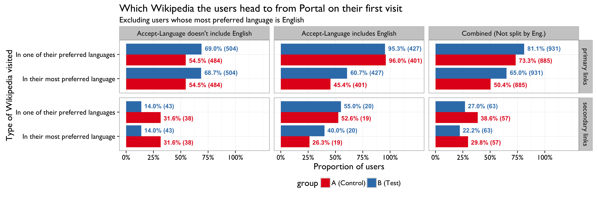

```{r setup, include = FALSE}
knitr::opts_chunk$set(echo = FALSE, message = FALSE, warning = FALSE)
```

\renewcommand{\abstractname}{Executive Summary}
\begin{abstract}
...
\end{abstract}

## Introduction

The Wikimedia Foundation (WMF) is dedicated to encouraging the growth, development, and distribution of free, *multilingual*, educational content. WMF operates Wikipedia, a project to build free encyclopedias in *all languages of the world*. For the Discovery Department's Portal team (tasked with making the wikipedia.org a more engaging and friendlier portal to free knowledge), it is important that all visitors, regardless of language, receive a more welcoming experience.


\newpage

## Analyses

### Sampling and Bucketing

In Fig. 2 we see that bucketing -- assigning randomly sampled users to either controls ("A") or the test group ("B") -- was performed evenly, without bias towards any particular language(s). In Fig. 3 we can see that if we look at just the clickthrough by group without breaking it up by section and without taking into consideration the user's preferred languages (from their Accept-Language header), the two groups behave nearly identically in aggregate.


\newpage

### Clickthrough Rates

Our **[previous investigation](https://commons.wikimedia.org/wiki/File:Analysis_of_Clickthrough_Rates_and_User_Preferred_Languages_on_Wikipedia_Portal.pdf)** of language preferences and engagement with Portal revealed that users whose preferences include English search more and engage with the primary links (the language links around the Wikipedia logo) more than users whose preferences do not include English. We see the same pattern in Fig. 4, where users whose preferences include English are much more likely to engage with the primary language links and the search box, while users whose preferences do not include English are more likely to engage with the secondary language links.

|Includes English                        |link      |group       | Clickthrough Rate (%)|
|:---------------------------------------|:---------|:-----------|---------------------:|
|Accept-Language doesn't include English |primary   |A (Control) |                 16.49|
|Accept-Language doesn't include English |primary   |B (Test)    |                 17.33|
|Accept-Language doesn't include English |search    |A (Control) |                 26.06|
|Accept-Language doesn't include English |search    |B (Test)    |                 25.35|
|Accept-Language doesn't include English |secondary |A (Control) |                  1.51|
|Accept-Language doesn't include English |secondary |B (Test)    |                  1.50|
|Accept-Language includes English        |primary   |A (Control) |                 21.18|
|Accept-Language includes English        |primary   |B (Test)    |                 22.50|
|Accept-Language includes English        |search    |A (Control) |                 38.22|
|Accept-Language includes English        |search    |B (Test)    |                 35.67|
|Accept-Language includes English        |secondary |A (Control) |                  0.90|
|Accept-Language includes English        |secondary |B (Test)    |                  0.87|

We can also see that in both sets of users, the test group is slighly more likely to engage with the primary links (the part affected by the A/B test) than the control group. Specifically, when considering only the users whose preferences included English (where we observed the largest difference), the test group has a 1.32% higher primary link clickthrough and is 1.064 times more likely to clickthrough than the control group. Unfortunately, these differences aren't "statistically significant" -- the 95% Bayesian confidence intervals include 0 for the difference of proportions and 1 for the relative risk, meaning we don't have evidence of big impact. The same numbers for the users who did not include English are: 0.84% difference and 1.053 times more more likely to click on a primary link.


\newpage

### Destination





